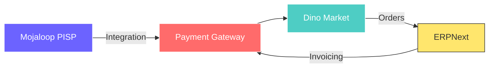

<div align="center">

# 👋 Blandine RUFINO

### Fullstack Developer • Fintech Builder • Mojaloop Integrator


[](https://www.linkedin.com/in/mondoukpè-blandine-rufino-6599942b6/)
[](mailto:rufinoblandine2002@gmail.com)
[](https://github.com/Blando-05)

</div>

---

## 🚀 About Me

```typescript
const blandine = {
    location: "Africa 🌍",
    currentFocus: "Dino Market & Payment Solutions",
    learning: ["Mojaloop", "Kafka", "Microservices", "Event-Driven Architecture"],
    interests: ["Fintech", "AI", "Distributed Systems", "Open Banking"],
    funFact: "I code faster than I choose an outfit 😄"
};
```

---

## 💻 Tech Stack

<div align="center">

### Languages & Frameworks


### Databases & Tools


### Specialized


</div>

---

## 🎯 Featured Projects

<div align="center">

<table>
<tr>
<td width="50%">

### 🛒 Dino Market
E-commerce platform for African markets
- Multi-vendor marketplace
- Payment gateway integration
- Real-time inventory management

**Tech:** Laravel • React • MySQL • Docker

</td>
<td width="50%">

### 💳 BFTPayPro
Automated subscription & payment management
- Recurring billing engine
- Payment orchestration
- Customer portal

**Tech:** Django • Kafka • PostgreSQL

</td>
</tr>
<tr>
<td width="50%">

### 🏦 Mojaloop Integration
Open Banking & Payment Switch
- PISP transaction requests (PR #30)
- Real-time payment processing
- FSPIOP API implementation

**Tech:** Node.js • TypeScript • Hapi.js

</td>
<td width="50%">

### 🔗 ERPNext Connector
ERP-to-Payment integration layer
- Frappe Framework customization
- Financial system sync
- Automated reconciliation

**Tech:** Python • Frappe • REST APIs

</td>
</tr>
</table>

</div>

---

## 📊 GitHub Stats

<div align="center">


</div>

---

## 🏆 Achievements

<div align="center">


</div>

---

## 🌱 Currently Working On



---

## 💡 Open Source Contributions

<div align="center">

[](https://github.com/mojaloop/tpp-api-svc/pull/30)
[](https://github.com/frappe/erpnext)

</div>

---

<div align="center">

### ✨ *"Building the future, one line of code at a time"*


</div>
